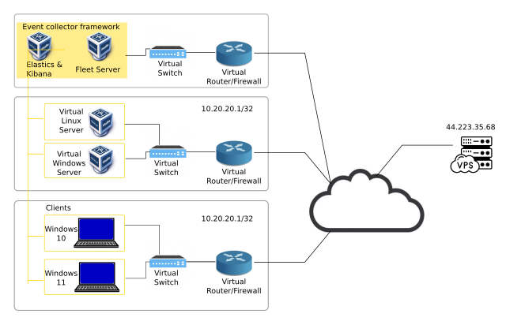

# Day 1


#### Step 1. First Network Idea:


_image caption2_

##### **1.1. Starting planning:
- Given that each physical server has 08 Cores and 16 GB of RAM, I think is proper to deploy  **servers** in one server and **clients** in another, and the **event-collector framework** in a third server.
<!-- - {: w="700" h="400" } -->
- So, first step is to deploy an OPN Sense Router in each server.

##### 1.2. Configuring the networking in Virtualbox

So, we will have our lab network distributed in three different servers.
Each of the servers, has a public IP Address.
So, from my criteria, I see two practical options to connect the three networks:
- Either we use VPN tunnels for each connection
![[Pasted image 20240730080744.png]]
- or either we use a fourth router. 
![[Pasted image 20240730080859.png]]

- But, I guess for now, we will take a look into the VPN solution because the second one is more complex. Maybe for another stage in the research.

So we are considering this topology:
![[Pasted image 20240730080744.png]]

To start case-showing this network architecture, we will start on server 1 with the implementation of the OPNSense Router.
#### Step 2. Deploy OPNSense Router in Server \#1

- we go to https://opnsense.org/download/
- we setup the download selector:
- ![[Pasted image 20240730082617.png]]
- we right-click on "Download" button and click on "Copy Link address" and obtain a file-link that we can download with `wget` 
- https://mirror.serverion.com/opnsense/releases/24.7/OPNsense-24.7-dvd-amd64.iso.bz2
- It has to be the DVD image.
- we download it
- ![[Pasted image 20240730082859.png]]
- We un-compress it: `bunzip2 -k OPNSense-24.7-dvd-amd64.iso.bz2`
- ![[Pasted image 20240730082919.png]]
- And we create the router vm with virtualbox:
```
oscar@itm2:~/scripts$ cat deploy_opnsense.sh 
#!/bin/bash

# Set VM name and parameters
VM_NAME="OPNSense"
COMPRESSED_ISO_PATH="/home/oscar/Downloads/OPNsense-24.7-dvd-amd64.iso.bz2"
ISO_PATH="/home/oscar/Downloads/OPNsense-24.7-dvd-amd64.iso"
VBOX_DISK="/home/oscar/VirtualBox VMs/OPNSense/opnsense.vdi"
VM_RAM=6144
VM_VRAM=16
VM_CPUS=4
DISK_SIZE=20480 # Size in MB, equivalent to 20 GB

# Check if paths are set
#if [[ "$COMPRESSED_ISO_PATH" == "/home/oscar/Downloads/OPNsense-24.7-dvd-amd64.iso.bz2" ]]; then
#    echo "Please update the COMPRESSED_ISO_PATH and VBOX_DISK variables with actual paths."
#    exit 1
#fi

# Uncompress the ISO file if not already uncompressed
if [ ! -f "$ISO_PATH" ]; then
    echo "Uncompressing the ISO file..."
    bunzip2 -k "$COMPRESSED_ISO_PATH"
    if [ $? -ne 0 ]; then
        echo "Failed to uncompress the ISO file."
        exit 1
    fi
    echo "ISO file uncompressed successfully."
fi

# Create a new VM
VBoxManage createvm --name "$VM_NAME" --ostype "FreeBSD_64" --register

# Set memory and CPU
VBoxManage modifyvm "$VM_NAME" --memory $VM_RAM --vram $VM_VRAM --cpus $VM_CPUS

# Create a virtual disk
VBoxManage createhd --filename "$VBOX_DISK" --size $DISK_SIZE

# Attach the virtual disk
VBoxManage storagectl "$VM_NAME" --name "SATA Controller" --add sata --controller IntelAhci
VBoxManage storageattach "$VM_NAME" --storagectl "SATA Controller" --port 0 --device 0 --type hdd --medium "$VBOX_DISK"

# Attach the ISO file
VBoxManage storagectl "$VM_NAME" --name "IDE Controller" --add ide
VBoxManage storageattach "$VM_NAME" --storagectl "IDE Controller" --port 0 --device 0 --type dvddrive --medium "$ISO_PATH"

# Set boot order
VBoxManage modifyvm "$VM_NAME" --boot1 dvd --boot2 disk --boot3 none --boot4 none

# Network settings
VBoxManage modifyvm "$VM_NAME" --nic1 bridged --bridgeadapter1 "eno2"  # Change "eno2" to your actual network interface
VBoxManage modifyvm "$VM_NAME" --nic2 intnet  # Internal network for LAN

# Optional: Enable I/O APIC
VBoxManage modifyvm "$VM_NAME" --ioapic on

# Optional: Enable EFI if required
# VBoxManage modifyvm "$VM_NAME" --firmware efi

echo "OPNsense VM creation script has finished."

```

- `VBoxManage showvminfo "OPNSense" | grep -i "NIC"`
```
oscar@itm2:~/scripts$ VBoxManage showvminfo "OPNSense" | grep -i "NIC"

NIC 1:                       MAC: 08002778CB05, Attachment: Bridged Interface 'eno2', Cable connected: on, Trace: off (file: none), Type: 82540EM, Reported speed: 0 Mbps, Boot priority: 0, Promisc Policy: deny, Bandwidth group: none

NIC 2:                       MAC: 080027F84436, Attachment: Internal Network 'intnet', Cable connected: on, Trace: off (file: none), Type: 82540EM, Reported speed: 0 Mbps, Boot priority: 0, Promisc Policy: deny, Bandwidth group: none

```


**USED COMMANDS**
```
  251  VBoxManage startvm "OPNSense" --type headless
  252  VBoxManage list vms
  253  VBoxManage list runningvms

  302  wget https://mirror.serverion.com/opnsense/releases/24.7/OPNsense-24.7-dvd-amd64.iso.bz2
  306  bunzip2 -k OPNsense-24.7-dvd-amd64.iso.bz2 
  369  VM_NAME="OPNSense"
  376  COMPRESSED_ISO_PATH="/home/oscar/Downloads/OPNsense-24.7-dvd-amd64.iso.bz2"
  377  ISO_PATH="/home/oscar/Downloads/OPNsense-24.7-dvd-amd64.iso"
  378  VBOX_DISK="/home/oscar/VirtualBox VMs/OPNSense/opnsense.vdi"
  379  VM_RAM=6144
  380  VM_VRAM=16
  381  VM_CPUS=4
  382  DISK_SIZE=20480

  389  VBoxManage createvm --name "$VM_NAME" --ostype "FreeBSD_64" --register
  390  VBoxManage modifyvm --filename "$VBOX_DISK" --size $DISK_SIZE
  391  VBoxManage storagectl "$VM_NAME" --name "SATA Controller" --add sata --cotroller IntelAhci
  392  VBoxManage storagectl "$VM_NAME" --name "SATA Controller" --add sata --controller IntelAhci
  393  VBoxManage storageattach "$VM_NAME" --storagectl "SATA Controller" --port 0 --device 0 --type hdd --medium "$VBOX_DISK"
  394  VBoxManage createhd --filename "$VBOX_DISK" --size 20480
  395  VBoxManage storageattach "$VM_NAME" --storagectl "SATA Controller" --port 0 --device 0 --type hdd --medium "$VBOX_DISK"
  396  VBoxManage storagectl "VM_NAME" --name "IDE Controller" --add ide
  397  VBoxManage storagectl "$VM_NAME" --name "IDE Controller" --add ide
  398  VBoxManage storageattach "$VM_NAME" --storagectl "IDE Controller" --port 0 --device 0 --type dvddrive --medium "$ISO_PATH"
  399  VBoxManage modifyvm --boot1 dvd --boot2 disk --boot3 none --boot4 none
  400  VBoxManage modifyvm "$VM_NAME" --boot1 dvd --boot2 disk --boot3 none --boot4 none
  404  VBoxManage modifyvm "$VM_NAME" --nic1 bridged --bridgeadapter1 "eno1"
  405  VBoxManage modifyvm "$VM_NAME" --nic2 intnet
  406  VBoxManage modifyvm "$VM_NAME" --ioapic on
```

https://chatgpt.com/share/cb2a0b74-af8a-43a5-903a-d2ee96803e5c
- `how to enable RDP protocol in a ubuntu server?`
```
sudo apt update
sudo apt install xrdp -y
sudo apt install xfce4 xfce-goodies -y
echo xfce4-session > ~/.xsession
sudo sed -i.bak '/fi/a startxfce4' /etc/xrdp/startwn.sh
sudo systemctl restart xrdp
sudo ufw allow 3389/tcp
sudo systemctl enable xrdp
```

- `how can I verify which is the running desktop environment in a ubuntu machine terminal?` 

```
echo $XDG_CURRENT_DESKTOP
echo $DESKTOP_SESSION
ps -e | grep -E -i 'gnome|kde|xfce|lxde|mate|cinnamon|openbox|fluxbox'
loginctl show-session $(loginctl show-user $USER -p Display --value) -p Type
gnome-shell --version

sudo apt install xdpyinfo
xdpyinfo | grep -A 10 "screen #0"

ls /usr/share/xsessions/

```

We lost connectivity
![[Pasted image 20240801134418.png]]

### Technical Requests

- Verify with admin the enabling of bidirectional traffic port 3389 tcp
- If that does not work of if it is not the problem, then, request for a new Ubuntu 22.04 server with desktop installation.
- 

### We found a big problem. 
### Is it possible to create a pre-configured Ubuntu server machine?

# PENDING TO ADD DOCUMENTATION ABOUT THE FOUND ERROR (delay: 2 weeks)


